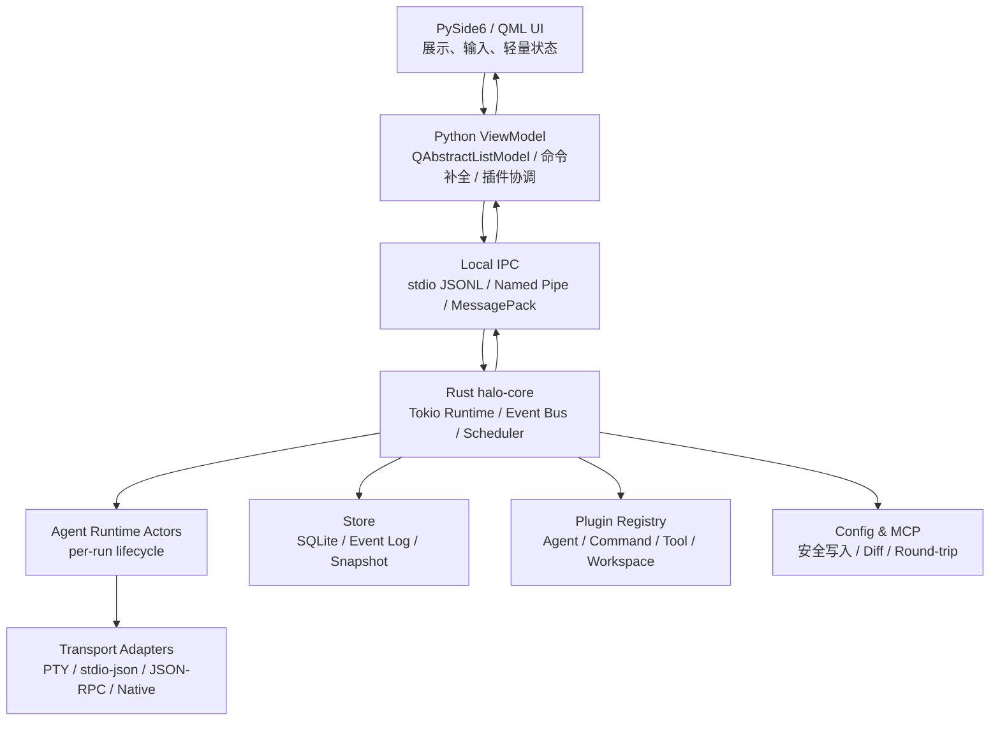
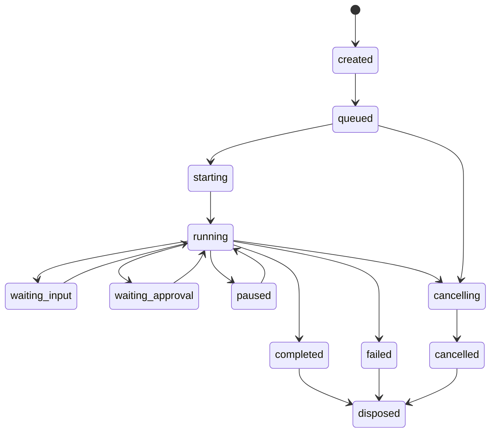

# Halo Studio 原生多 Agent 工作台重构设计

日期：2026-07-22

## 0. 输入与结论

本设计依据 `request.md` 制定；`mission.md` 当前为空文件。本轮需求已经把项目目标从「Electron + React 的多 CLI 桌面壳」升级为「纯原生、高性能、多 Agent、AI Native 的桌面开发工作台」。

核心结论：

1. 当前 Electron / React / Vite / Web UI 路线与新约束冲突，应进入大规模迁移。
2. 第一阶段不继续扩大旧 UI，而是冻结旧实现，保留可迁移业务逻辑作为参考。
3. 推荐目标架构为 **PySide6/QML 原生 UI + Rust Tokio Runtime Sidecar**。
4. 终端不再是主交互界面，只作为 Debug 抽屉保留；主界面围绕 Agent 消息流和可视化工作流。
5. 所有 Agent 通信必须事件化，统一经过 Event Bus、Command Dispatcher、Scheduler 和 Agent Runtime。

参考项目与资料：

- CC Switch：功能组织参考，包括 Provider、MCP、Skills、Sessions、Tray、Usage、Proxy 等管理思路；不采用其 Tauri/Web UI 技术栈。
- Qt for Python / PySide6：原生桌面 UI 与 QML/Python 集成基础。
- Tokio：Rust 高并发 runtime 候选。

## 1. 当前项目分析报告

### 1.1 当前模块结构

当前项目主要由以下模块组成：

- `src/main`：Electron 主进程、IPC、Agent 探测、PTY 管理、MCP 配置预览、配置写入服务。
- `src/renderer`：React UI、Dashboard、Settings、History、TerminalPane、InspectorPanel、MCP 面板。
- `src/shared`：Agent、API、Config、MCP 的共享 TypeScript 类型。
- `src/tests`：Vitest + jsdom + 主进程逻辑测试。
- `server.ts` 与 `src/renderer/webApiBridge.ts`：Web 端残留，不符合纯桌面要求。

### 1.2 当前架构问题

当前系统围绕终端而非 Agent 构建：

- `src/shared/api.ts` 的会话协议只有 `start/stop/write/resize/onData/onExit`，本质是终端字节流 API。
- `src/main/ipc.ts` 直接把 PTY 数据转发给窗口，没有事件总线、背压、事件序号、订阅范围和快照恢复。
- `src/main/pty/ptyManager.ts` 同时负责命令映射、PTY 生命周期、Mock 演示和输出转发，职责过重。
- `src/shared/agents.ts` 把 AgentId 固定成 union，不适合动态插件化 Agent。
- React UI 与 Electron IPC 耦合，迁移到原生 UI 时难以复用。

### 1.3 当前性能瓶颈

主要瓶颈来自渲染层：

- 全屏 `.starfield` 多层径向渐变持续动画。
- 行星、星云、环形轨道持续 transform、blur、filter、box-shadow。
- 大面积 `backdrop-filter` 和多层 shadow 在 Electron 下开销高。
- `TerminalPane` 使用 xterm、光标闪烁、ResizeObserver 和原始字节流写入，作为主视图会放大重绘压力。
- Dashboard 有模拟 `setTimeout` 对话逻辑，交互价值低。

目标应改为：

- 默认静态背景。
- 局部轻量动效。
- 单一 Animation Scheduler。
- 窗口隐藏、失焦、空闲时暂停非必要动画。
- Thinking 动效统一 8-12 FPS，不使用粒子、无限 glow 或大面积 blur。

### 1.4 当前 UI 问题

- 首屏偏大 Hero/装饰，不像高频使用的开发工作台。
- Dashboard、Workspace、Settings、MCP、History 信息层级松散。
- 终端作为主交互，用户必须从原始输出推断 Agent 工作状态。
- 字号和空间密度不够统一，部分中文文案存在编码异常。
- 功能入口多，但很多仍是占位或弱价值功能。

### 1.5 当前安全与维护风险

- PTY 启动继承完整 `process.env`，存在敏感变量泄漏风险。
- IPC 入参缺少统一 schema 校验。
- 配置回滚入口需要和真实写入一样套路径 guard。
- MCP TOML/JSON 生成需要 parse round-trip，避免 key/table 注入。
- Web 端残留容易让项目回退到被禁止的浏览器 UI 路线。

## 2. 架构方案选择

### 2.1 方案对比

| 方案 | 优点 | 风险 | 结论 |
| --- | --- | --- | --- |
| PySide6/QML only | 原生 UI 生产效率高，QML 适合现代界面 | Python 主线程与 GIL 不适合高并发 runtime | 不作为最终核心 |
| Rust egui/iced/slint | 性能强，部署单一，Tokio 集成直接 | 长消息列表、复杂 IDE 布局和毛玻璃质感成本较高 | 可作为长期 POC |
| PySide6/QML + Rust Sidecar | UI 表达力、性能、并发、可维护性平衡好 | IPC 和打包复杂度更高 | 推荐 |

最终推荐：**PySide6/QML 原生 UI + Rust Tokio Runtime Sidecar**。

### 2.2 目标架构图



### 2.3 分层职责

#### UI Layer

- 只负责展示和输入。
- 不直接执行 shell，不直接读写配置文件。
- 使用虚拟列表显示消息流和工作流卡片。
- 终端仅作为 Debug 抽屉。

#### Python ViewModel

- 管理 QML model、UI selection、命令补全弹层、轻量业务状态。
- 转发用户 intent 到 Rust runtime。
- 插件脚本加载和 UI 扩展注册。

#### Rust Runtime

- Event Bus。
- Command Dispatcher。
- Scheduler。
- Agent Runtime Actor。
- PTY / RPC / stdio transport。
- Output Parser。
- Diff / Patch / Config safety。
- SQLite event log、snapshot、ring buffer。

#### Plugin Layer

- 插件通过 manifest 声明能力。
- 首阶段只启用内置插件。
- 第三方插件默认无 shell 和文件写权限。

## 3. 目标目录结构

```text
D:\Halo Studio
├─ apps\
│  └─ desktop\
│     ├─ pyproject.toml
│     ├─ halo_desktop\
│     │  ├─ main.py
│     │  ├─ app_controller.py
│     │  ├─ ipc_client.py
│     │  └─ viewmodels\
│     └─ qml\
│        ├─ Main.qml
│        ├─ components\
│        └─ styles\
├─ crates\
│  ├─ halo-protocol\
│  ├─ halo-core\
│  ├─ halo-scheduler\
│  ├─ halo-agent-runtime\
│  ├─ halo-pty\
│  ├─ halo-config\
│  ├─ halo-store\
│  └─ halo-ipc\
├─ plugins\
│  └─ agents\
│     ├─ claude-code\agent.toml
│     ├─ codex-cli\agent.toml
│     ├─ opencode\agent.toml
│     └─ pi\agent.toml
├─ docs\
│  └─ architecture\
├─ tests\
│  ├─ runtime\
│  ├─ security\
│  └─ stress\
└─ legacy-electron\
```

迁移策略：旧 Electron 代码短期可移动到 `legacy-electron`，作为业务逻辑参考；第一阶段原生应用可跑通后，删除 Web 端入口和 React 渲染链。

## 4. Agent Runtime 数据模型

### 4.1 Agent Profile

```ts
type AgentId = string;

interface AgentProfile {
  id: AgentId;
  name: string;
  provider: "claude" | "openai" | "opencode" | "pi" | "custom";
  transport: "pty" | "stdio-json" | "json-rpc" | "native-rust";
  capabilities: Array<"chat" | "shell" | "diff" | "mcp" | "resume" | "approval">;
  commands: SlashCommandSpec[];
}
```

### 4.2 Agent Run

```ts
type RunState =
  | "created"
  | "queued"
  | "starting"
  | "running"
  | "waiting_input"
  | "waiting_approval"
  | "paused"
  | "cancelling"
  | "cancelled"
  | "completed"
  | "failed"
  | "disposed";

interface AgentRun {
  id: string;
  agentId: AgentId;
  workspaceId: string;
  state: RunState;
  createdAt: number;
  updatedAt: number;
  tokenUsage?: TokenUsage;
}
```

### 4.3 Runtime Event

```ts
interface RuntimeEvent<T = unknown> {
  id: string;
  runId: string;
  seq: number;
  time: number;
  type: AgentEventType;
  payload: T;
}

type AgentEventType =
  | "run.state"
  | "message.created"
  | "message.delta"
  | "message.completed"
  | "thinking.delta"
  | "tool.started"
  | "tool.delta"
  | "tool.completed"
  | "tool.failed"
  | "shell.started"
  | "shell.stdout"
  | "shell.stderr"
  | "shell.exited"
  | "diff.created"
  | "patch.requested"
  | "patch.applied"
  | "patch.failed"
  | "progress.updated"
  | "token.updated"
  | "approval.requested"
  | "error"
  | "log.debug";
```

## 5. Agent 生命周期



控制策略：

- 取消：先软取消，发送 Ctrl+C 或 RPC cancel；超时后 kill process。
- 暂停：暂停调度队列和 UI 输出消费，必要时不暂停底层进程。
- 恢复：从 snapshot 和 event seq 续流。
- 失败：失败事件进入主消息流，同时保存 Debug 原始输出。

## 6. Scheduler 与高并发设计

推荐模型：**Actor + Weighted Fair Queue**。

- 每个 Agent Run 一个 Actor，独立状态机、取消令牌、事件序号。
- 全局 Scheduler 管理 `maxGlobalRuns`。
- Agent 级队列限制 `maxPerAgentRuns`。
- Workspace 级队列限制 `maxPerWorkspaceRuns`。
- Event Bus 对 shell stdout、token delta 做批处理，UI 每 50-100ms 接收一批。
- 每个 Run 保留 `RunSnapshot + ring buffer events`。
- 长日志落盘，UI 只保留可见窗口附近的数据。

## 7. UI Blueprint

### 7.1 主布局

```text
┌──────────────────────────────────────────────────────────────┐
│ Top Bar: Workspace / Agent / Run State / Quick Actions        │
├──────────────┬───────────────────────────────┬───────────────┤
│ Navigation   │ Agent Workspace                │ Inspector     │
│ 260px        │ Chat + Workflow Timeline        │ 320-360px     │
│              │ Command Composer                │               │
└──────────────┴───────────────────────────────┴───────────────┘
```

左侧：

- Workspaces。
- Agents。
- Sessions。
- Config Center。
- Settings。

中间：

- Session Header。
- VirtualMessageList。
- User / Assistant Bubble。
- Thinking / ToolCall / Shell / Diff / Summary 卡片。
- CommandComposer。
- DebugTerminalDrawer 默认收起。

右侧：

- Agent 状态。
- 当前任务队列。
- MCP 摘要。
- 文件变更。
- Token / 耗时 / 错误信息。

### 7.2 视觉 Token

- 字体：`Segoe UI`, `Microsoft YaHei UI`；代码字体 `Cascadia Mono`。
- 正文：14px。
- 消息：14-15px。
- 侧栏：13px。
- 说明：12px。
- 标题：18-22px。
- 面板圆角：8px。
- 消息圆角：12px。
- 输入框圆角：18-22px。

颜色：

```text
bg.main      #0b0d12
bg.panel     #151821
bg.glass     rgba(28, 32, 44, 0.72)
border       rgba(255, 255, 255, 0.08)
text.primary #f3f5f8
text.muted   #9aa3b2
accent       #8b5cf6
cyan         #22d3ee
success      #22c55e
warning      #f59e0b
danger       #ef4444
```

### 7.3 动画系统

删除：

- 星空持续移动。
- 行星浮动。
- 星云脉冲。
- 大面积 blur。
- 永久 pulse。
- 大面积 box-shadow。

保留：

- 进入/退出 `opacity + translateY`，120-180ms。
- hover 只改变背景和边框。
- focus 使用轻微 accent border。
- Thinking 指示器由统一 scheduler 驱动，8-12 FPS。

规则：

- 窗口最小化、失焦、空闲 5 秒后暂停非必要动画。
- 提供「低性能模式」，关闭全部微动效。
- UI 不允许组件私建高频 timer。

## 8. Chat 与 Workflow 体验

主交互顺序：

```text
User Message
↓
Agent Thinking
↓
Tool Call / Shell / File Read
↓
Diff / Patch / Approval
↓
Assistant Summary
```

消息卡片类型：

- `UserBubble`
- `AgentBubble`
- `WorkflowStepCard`
- `ToolCallCard`
- `ShellCommandCard`
- `DiffPreviewCard`
- `ApprovalRequestCard`
- `ErrorCard`
- `TokenUsageBadge`

终端只作为 Debug 页面：

- 默认不显示。
- 用户点击「Debug Terminal」后展开。
- 原始 stdout/stderr 全量进入 Debug，不污染主消息流。

## 9. Slash 命令补全

命令来源：

1. 全局命令：`/help`、`/run`、`/test`、`/review`、`/git`、`/settings`、`/terminal`。
2. Agent 命令：`/claude`、`/codex`、`/gemini`、`/opencode`、`/pi`。
3. 上下文命令：选中文件时出现 `/diff`、`/apply`、`/explain`。

补全行为：

- `/` 触发。
- `Tab` 补全当前项或公共前缀。
- `Enter` 执行选中项。
- `↑↓` 切换候选。
- `Esc` 关闭。
- 支持模糊搜索、最近使用、收藏。
- 参数补全支持 `--continue`、`--resume`、`--permission`、`--model`、`--sandbox`。

评分策略：

```text
prefix match     40
fuzzy continuity 20
current agent    20
recent usage     10
favorite         10
```

## 10. 插件系统设计

插件类型：

- Agent Plugin。
- Command Plugin。
- Tool Plugin。
- Sidebar Plugin。
- Workspace Plugin。
- Model Provider Plugin。

Manifest 示例：

```toml
id = "codex-cli"
name = "Codex CLI"
version = "0.1.0"
kind = "agent"

[permissions]
shell = false
file_read = true
file_write = false
mcp = true

[transport]
type = "pty"
command = "codex"
```

首阶段策略：

- 只加载内置插件。
- 第三方插件 manifest 校验通过后仍默认禁用。
- Shell / file write / network 权限必须显式授权。

## 11. 安全设计

P0 安全要求：

- 禁止字符串拼接执行 shell。
- command、cwd、args、env 经过策略层校验。
- 敏感环境变量默认不传给 Agent。
- 所有配置写入必须 diff、备份、原子写入、回滚。
- 回滚也必须经过 workspace guard。
- MCP JSON/TOML 必须 parse round-trip。
- Windows 路径 guard 覆盖 symlink、junction、UNC、ADS、大小写绕过。
- 插件默认无文件写入和 shell 权限。

## 12. 测试与验收

### 12.1 迁移测试

- 应用启动不依赖 Electron、React、Vite 或浏览器窗口。
- Windows 启动后不打开本地 Web 预览端口。
- 旧 Web 文件删除或移动到 legacy。

### 12.2 并发测试

- fake Agent runtime 同时运行 4、16、32 个 Agent。
- UI 不阻塞。
- 消息不乱序、不丢失。
- 取消 2 秒内回收子进程。

### 12.3 行为测试迁移

保留行为：

- Agent 探测失败不阻塞 UI。
- Config write guard。
- Config backup / rollback。
- MCP preview。
- Project MCP target。

删除旧测试：

- Electron runtime。
- Electron preload path。
- Web fallback。
- React hook/jsdom 形式测试。

## 13. 分阶段实施计划

### Phase 0：冻结旧实现与建立迁移基线

- 写入本设计文档。
- 标记 Electron/React 为 legacy。
- 明确删除 Web 端目标。
- 建立原生迁移验收标准。

### Phase 1：原生桌面壳 MVP

- 新建 `apps/desktop` PySide6/QML 应用骨架。
- 新建 `crates/halo-protocol` 和 `crates/halo-core`。
- 使用 fake runtime 展示 4 个 Agent 工作区。
- 实现 Agent Timeline、CommandComposer、SlashCompletionPopup。
- 不接入真实 shell 写入。

### Phase 2：Rust Runtime 与事件总线

- Event Bus。
- Scheduler。
- Agent Run Actor。
- Snapshot + ring buffer。
- stdio JSONL IPC。

### Phase 3：Agent Adapter 与 Debug Terminal

- 将 Codex/Claude/OpenCode/Pi 定义为内置插件。
- 先接入 PTY transport。
- 输出解析成 RuntimeEvent。
- 原始输出进入 Debug Terminal。

### Phase 4：配置与 MCP 安全迁移

- 迁移 config write guard。
- 迁移 backup/rollback。
- MCP parse round-trip。
- Workspace policy。

### Phase 5：性能与压力测试

- Idle CPU 基线。
- 30 分钟内存稳定性。
- 4/16/32 Agent fake runtime 压测。
- 窗口隐藏/失焦/空闲动画暂停。

### Phase 6：文档、打包和旧代码清退

- README 更新。
- Architecture / API / Migration Guide。
- Windows 打包。
- 删除 Web/Electron 代码或归档到 legacy。

## 14. 第一阶段开发范围

第一阶段只交付可运行纵切，不一次性重写全部功能：

1. 原生桌面窗口可启动。
2. 左侧 Agent/Workspace 导航。
3. 中间 Agent 聊天流和工作流事件卡片。
4. 右侧 Inspector。
5. `/` 命令补全。
6. fake Agent runtime 支持 4 个 Agent 并发展示。
7. 静态轻量背景，无持续高开销动画。
8. 基础单元测试和 fake 并发测试。

暂不做：

- 真实配置写入。
- 第三方插件执行。
- 真实多 CLI 深度解析。
- 完整安装包。
- 旧功能 1:1 迁移。

## 15. 决策记录

1. 放弃继续扩展 Electron/React UI，因为新需求明确禁止浏览器渲染。
2. 不使用 Tauri，虽然 CC Switch 是优秀参考，但 Tauri 仍依赖 WebView。
3. 采用 PySide6/QML 作为 UI，是为了兼顾原生体验、复杂布局和开发效率。
4. 采用 Rust Tokio Runtime，是为了把高并发 Agent、PTY、Parser、Diff、Scheduler 放到更可靠的执行层。
5. 首阶段使用 fake Agent，是为了先验证架构、布局、性能和交互，不被真实 CLI 兼容性拖慢。

