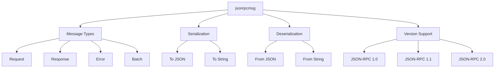

# JSON-RPC Message Library Architecture Plan

This document outlines the architecture for implementing a Rust library to serialize and deserialize JSON-RPC messages using serde.

## Library Structure



## Core Components

### 1. Message Types

The library will define Rust structs/enums that map to the JSON-RPC message formats:

- `Request`: Represents a JSON-RPC request message
- `Response`: Represents a JSON-RPC response message
- `Error`: Represents a JSON-RPC error object
- `Batch`: Represents a batch of JSON-RPC messages
- `Version`: Enum to represent different JSON-RPC versions

### 2. Serialization

The library will provide functions to serialize Rust objects to JSON-RPC formatted strings:
- `to_request_string()`: Serialize a Request to JSON string
- `to_response_string()`: Serialize a Response to JSON string
- `to_batch_string()`: Serialize a Batch to JSON string

### 3. Deserialization

The library will provide functions to deserialize JSON-RPC formatted strings to Rust objects:
- `from_request_string()`: Deserialize a JSON string to Request
- `from_response_string()`: Deserialize a JSON string to Response
- `from_batch_string()`: Deserialize a JSON string to Batch

### 4. Version Support

The library will support all three versions of JSON-RPC with appropriate handling for version-specific features.

## Module Structure

```
src/
├── lib.rs          # Public API exports
├── request.rs      # Request message types and implementations
├── response.rs     # Response message types and implementations
├── error.rs        # Error types and implementations
├── batch.rs        # Batch message types and implementations
├── version.rs      # Version enum and version-specific logic
├── serialize.rs    # Serialization functions
├── deserialize.rs  # Deserialization functions
└── utils.rs        # Utility functions
```

## Detailed Design

### Request Module

```rust
// request.rs
#[derive(Serialize, Deserialize, Debug, Clone)]
pub struct Request {
    // Version-specific fields will be handled with enums or optional fields
    #[serde(skip_serializing_if = "Option::is_none")]
    pub jsonrpc: Option<String>, // For v2.0
    
    #[serde(skip_serializing_if = "Option::is_none")]
    pub version: Option<String>, // For v1.1
    
    pub method: String,
    
    #[serde(skip_serializing_if = "Option::is_none")]
    pub params: Option<Params>,
    
    #[serde(skip_serializing_if = "Option::is_none")]
    pub id: Option<Id>,
}

#[derive(Serialize, Deserialize, Debug, Clone)]
#[serde(untagged)]
pub enum Params {
    Array(Vec<Value>),
    Object(Map<String, Value>),
}

#[derive(Serialize, Deserialize, Debug, Clone)]
#[serde(untagged)]
pub enum Id {
    String(String),
    Number(u64),
}
```

### Response Module

```rust
// response.rs
#[derive(Serialize, Deserialize, Debug, Clone)]
pub struct Response {
    #[serde(skip_serializing_if = "Option::is_none")]
    pub jsonrpc: Option<String>, // For v2.0
    
    #[serde(skip_serializing_if = "Option::is_none")]
    pub version: Option<String>, // For v1.1
    
    #[serde(skip_serializing_if = "Option::is_none")]
    pub result: Option<Value>,
    
    #[serde(skip_serializing_if = "Option::is_none")]
    pub error: Option<Error>,
    
    #[serde(skip_serializing_if = "Option::is_none")]
    pub id: Option<Id>,
}
```

### Error Module

```rust
// error.rs
#[derive(Serialize, Deserialize, Debug, Clone)]
pub struct Error {
    pub code: i32,
    pub message: String,
    
    #[serde(skip_serializing_if = "Option::is_none")]
    pub data: Option<Value>,
}
```

### Version Module

```rust
// version.rs
#[derive(Debug, Clone, PartialEq)]
pub enum Version {
    V1_0,
    V1_1,
    V2_0,
}

impl Version {
    pub fn from_string(s: &str) -> Option<Version> {
        match s {
            "1.0" => Some(Version::V1_0),
            "1.1" => Some(Version::V1_1),
            "2.0" => Some(Version::V2_0),
            _ => None,
        }
    }
}
```

### Batch Module

```rust
// batch.rs
#[derive(Serialize, Deserialize, Debug, Clone)]
#[serde(untagged)]
pub enum Message {
    Request(Request),
    Response(Response),
}

pub type Batch = Vec<Message>;
```

## Public API

The main lib.rs file will expose a clean public API:

```rust
// lib.rs
pub mod request;
pub mod response;
pub mod error;
pub mod batch;
pub mod version;
pub mod serialize;
pub mod deserialize;

// Re-export key types
pub use request::Request;
pub use response::Response;
pub use error::Error;
pub use batch::{Message, Batch};
pub use version::Version;

// Convenience functions
pub use serialize::{
    to_request_string,
    to_response_string,
    to_batch_string,
};

pub use deserialize::{
    from_request_string,
    from_response_string,
    from_batch_string,
};
```

## Implementation Strategy

1. **Start with JSON-RPC 2.0**: Since it's the most widely adopted version
2. **Add backward compatibility**: Implement support for 1.0 and 1.1 versions
3. **Handle version differences**: Use serde attributes to handle optional fields
4. **Provide convenience functions**: Make common operations easy to use
5. **Comprehensive testing**: Include tests for all versions and edge cases

## Error Handling

The library will use Rust's Result type for error handling:

- `SerializationError`: For serialization failures
- `DeserializationError`: For deserialization failures
- `ValidationError`: For invalid message formats

## Testing Strategy

- Unit tests for each message type
- Integration tests for serialization/deserialization
- Version-specific tests
- Edge case tests (notifications, batch requests, etc.)
- Compatibility tests between versions

## Performance Considerations

- Use serde's zero-copy deserialization where possible
- Minimize allocations
- Provide both owned and borrowed versions of data structures
- Use appropriate serde attributes to skip unnecessary fields

## Extensibility

- Allow custom error codes
- Support for custom parameter types
- Easy addition of new JSON-RPC versions
- Configurable serialization options